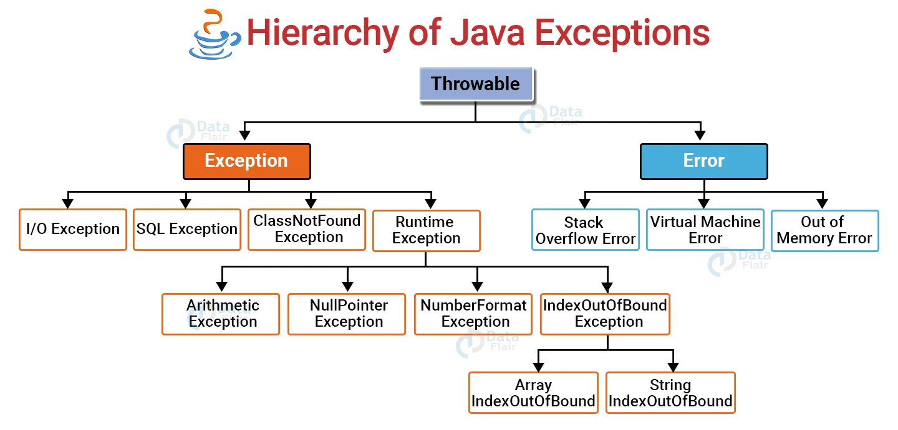

# OOD-Seminar-4

## Commands
sudo update-alternatives --config javac
cd /home/suhkth/Documents/javaOOP/OOD-Seminar-4/Seminar3/src/se/kth/iv1350/seminar3/
javac /home/suhkth/Documents/javaOOP/OOD-Seminar-4/Seminar3/src/se/kth/iv1350/seminar3/**/*.java
java -cp /home/suhkth/Documents/javaOOP/OOD-Seminar-4/Seminar3/src se.kth.iv1350.seminar3.startup.Main

## Short explanation about Exception

In object-oriented programming, exceptions are categorized into various types to handle different kinds of errors and exceptional conditions. The book "A First Course in Object-Oriented Development" categorizes exceptions into three main types:

1. **Checked Exceptions**:
   - **Definition**: These are exceptions that must be either caught or declared in the method's `throws` clause. They represent conditions that a reasonable application might want to catch.
   - **Usage**: Used for business logic errors, such as violations of business rules. For example, attempting to withdraw more money than the account balance might throw an `OverdraftException`.
   - **Example**: `AlreadyBookedException` in the car rental example, indicating that a car is already booked and cannot be booked again.
   - **Benefits**: Forces the programmer to handle potential error conditions, leading to more robust and reliable code.

2. **Unchecked Exceptions**:
   - **Definition**: These are exceptions that do not need to be declared in a method's `throws` clause. They are typically subclasses of `RuntimeException`.
   - **Usage**: Used for programming errors, such as logic errors or improper use of an API. Examples include `NullPointerException` and `ArrayIndexOutOfBoundsException`.
   - **Example**: `CarRegistryException` in the car rental example, indicating a failure in the underlying datastore.
   - **Benefits**: Simplifies method signatures and can lead to cleaner code when the exceptions represent truly unexpected conditions that should not occur if the program is correct.

3. **Errors**:
   - **Definition**: These are serious problems that a reasonable application should not try to catch. They are subclasses of `Error`, and most errors are abnormal conditions that are not expected to be recovered from.
   - **Usage**: Used for severe problems like `OutOfMemoryError` or `StackOverflowError` that usually indicate a problem with the runtime environment itself.
   - **Example**: Not explicitly mentioned in the book, but in general usage, they would be conditions that signal serious issues requiring intervention beyond normal application logic.

### Best Practices for Exception Handling:

1. **Choose between checked and unchecked exceptions**:
   - Use checked exceptions for recoverable conditions and business logic errors.
   - Use unchecked exceptions for programming errors and conditions that are not expected to be recovered from during normal operation.

2. **Use the correct abstraction level for exceptions**:
   - High-level layers should not need to catch low-level, detailed exceptions. Instead, convert them to more general exceptions appropriate for the higher level.

3. **Name the exception after the error condition**:
   - Exception names should clearly describe the error condition, such as `AlreadyBookedException`.

4. **Include information about the error condition**:
   - Exceptions should carry enough information to understand the error context, including messages and relevant data.

5. **Use functionality provided in `java.lang.Exception`**:
   - Inherit from `Exception` or `RuntimeException` and utilize their constructors to handle error messages and causes.

6. **Write Javadoc comments for all exceptions**:
   - Document the conditions under which exceptions are thrown using `@throws` tags in Javadoc.

7. **An object shall not change state if an exception is thrown**:
   - Ensure that an object's state remains unchanged if a method fails and throws an exception.

8. **Notify users and developers**:
   - Provide informative messages to users and log detailed error reports for developers.

9. **Write unit tests for the exception handling**:
   - Test that exceptions are thrown under the correct conditions and that they are handled properly.

These principles help create a robust and maintainable system by ensuring that exceptions are handled consistently and appropriately throughout the application     .

## What is a Logger?

A **logger** is a component used in software applications to record log messages, including errors, warnings, informational messages, and debugging details.
- Loggers help in monitoring, debugging, and auditing applications.
- They support different logging levels like DEBUG, INFO, WARN, ERROR, and FATAL.
- Implementing a logger typically involves defining an interface and providing concrete implementations for writing logs to files or other destinations.
- Using a logger in your application helps maintain a record of significant events and errors, aiding in diagnostics and maintaining application health.

## What is `SQLException`?

`SQLException` is a class in the `java.sql` package of Java's Standard Edition (SE) that is used to handle exceptions related to database operations. It is a checked exception that provides information on a database access error or other errors related to SQL operations.

### How Does `SQLException` Work?

`SQLException` works by providing detailed information about database errors that occur during the execution of SQL statements. It is typically thrown by methods in the `java.sql` package when there is a problem with accessing or interacting with a database.

### Key Features of `SQLException`

1. **Error Information**:
   - `SQLException` includes methods to retrieve detailed information about the error, such as:
     - `getMessage()`: Returns a description of the error.
     - `getSQLState()`: Returns the SQLState string, which is a standardized error code.
     - `getErrorCode()`: Returns a vendor-specific error code.
     - `getNextException()`: Retrieves the next `SQLException` in the chain, if there are multiple exceptions.

2. **Chaining Exceptions**:
   - SQL exceptions can be chained together, providing a linked list of exceptions. This is useful when multiple errors occur in a sequence of database operations.

3. **Handling Database Errors**:
   - `SQLException` allows developers to handle database-related errors in a structured way, ensuring that applications can respond appropriately to issues like connectivity problems, SQL syntax errors, or data integrity violations.

### Summary

`SQLException` is a key class in Java's `java.sql` package for handling database-related errors. It provides detailed information about SQL errors and allows for structured error handling and resource management in applications that interact with databases.

# chapter 7: Unit Testing using Junit

# Föreläsning 12: Exception handling
[Source:https://data-flair.training/blogs/java-exception/]
 

 

0. **Asynchronous vs. Synchronous**:
Synchronous exceptions are predictable based on the code and the data being processed. If the same code is executed with the same data, the synchronous exception will occur at the same place every time.
 Asynchronous exceptions are unpredictable in terms of timing because they depend on external factors or system states that can change independently of the program’s logic.
1. ** Exceptions**:
All exceptions must inherit java.lang.Exception (consult section 1.4 if you need to repeat
inheritance). In doing that, a lot of useful functionality is inherited, for example handling an
error message. The Exception class has both a constructor that takes a message, and a
method getMessage that returns the message.
 If the all custom exceptions are related is it good to create a abstraction that other can inheratic from.

2. **checked Exceptions**:
Checked exceptions are used for business logic errors. Such errors do not indicate that the
program has crashed, but that a business rule was broken. An example is a withdraw method
in a bank account. If a user tries to withdraw more money than the current balance of the
account, the method might throw an exception to indicate that the withdrawal is not allowed.
NoSuchItemfoundException is a checked exception.

3. **Unchecked Exceptions**:
Unchecked exceptions, on the other hand, are used for programming errors. A typical example is NullPointerException, which normally means that a method is called on an object that does not exist. This is an indication that there is a bug in the program.
DatabaseException is an unchecked exception.

4. **Abstraction level**:

* Exceptions follow a hierarchy, with base classes for broader categories and derived classes for specific issues.
* **DatabaseException** (base class) handles all database-related issues.
* **DatabaseServerNotRunningException** (derived class) handles a specific database issue.

**Exception Handling Best Practices**

* **Immutable Objects:** Once created, their state cannot be changed, promoting data integrity.
* **Never Ignore Exceptions:**  Always handle exceptions to prevent unexpected behavior.
* **Logging Exceptions:** Use logging to record exception details for debugging purposes.
* **User vs. Developer Information Needs:**
    * Users: Need user-friendly error messages without technical details.
    * Developers: Need detailed error messages for troubleshooting.

**Importance of Correct Abstraction Levels**

1. **Abstraction Level of Exceptions:**
   - **Low-Level Exceptions:** These are detailed technical exceptions that occur in the lower layers of the application, such as the integration layer (e.g., database errors).
   - **High-Level Exceptions:** These are more generic exceptions that are suitable for higher layers of the application, such as the business logic or user interface layers.

2. **User-Friendly and Secure Error Handling:**
   - **Not User-Friendly:** Displaying low-level, technical error messages directly to users is not user-friendly. For example, if a cash machine displayed "SQL syntax error" when a user tried to withdraw money, it would be confusing and alarming.
   - **Security Risks:** Exposing detailed technical information about the system, such as database errors, can pose security risks. Potential attackers could exploit this information to find vulnerabilities.

3. **Layer Independence:**
   - **Dependency Issues:** If the view layer (user interface) handles low-level exceptions directly, it creates a dependency between the view and the integration layer, which is undesirable. Each layer should remain independent to maintain a clean architecture.

### Example Scenario

#### Incorrect Approach:
- The integration layer throws a detailed `SQLException`(a specific low-level exception used when interacting with with a database using JDBC (Java Database Connectivity) to provide technical details about the database error).
- This `SQLException` is caught directly in the view layer.
- The view displays the detailed SQL error message to the user.

#### Correct Approach:
- The integration layer throws a detailed `SQLException`.
- The business logic layer catches the `SQLException`.
- The business logic layer then throws a more generic exception, such as `OperationFailedException`, which encapsulates the original `SQLException`.
- The view layer catches the `OperationFailedException` and displays a user-friendly error message to the user, without exposing technical details.

1. **Catching and Wrapping Exceptions:**
   - In the business logic layer, the detailed `SQLException` is caught and logged. Use a SQLException in Java to handle errors related to the database even if those errors stem from the server side, such as connectivity issues, timeout exceptions, or database server failures.
   - A more generic `OperationFailedException` is thrown, which includes the original `SQLException` as its cause.

2. **Propagating Exceptions:**
   - The `OperationFailedException` propagates to the view layer.
   - The view layer catches the `OperationFailedException` and displays a generic, user-friendly error message.

3. **Maintaining Abstraction Levels:**
   - The detailed technical exception (`SQLException`) does not traverse up to the view layer.
   - This maintains the independence of each layer and prevents exposing technical details to the user.

why high level expection is a part of view?
Say that a low-level layer (far from the view) throws some exception with a detailed technical
description of an error condition. An example could be that the integration layer fails to per-
form a database operation. Should this information be displayed to the user? Most certainly
not. First, it is not user friendly at all. What would you think if a cash machine said “sql
syntax error” when you tried to withdraw money? It would not be possible to know if the
amount had been withdrawn from the bank account, and it would probably not feel safe to use
that bank any more. Second, it could create security problems if detailed information about
the database was displayed to all users, including possible attackers. Now that it has been
established that this exception is not of interest to the user, the next question is if it then is of
any interest to the view layer? Most likely not, since anyway it shall not be displayed to the
user. Also, catching a database exception in the view creates a dependency from the view to
the integration layer, which is not desired. The conclusion is that it is often inappropriate that
an exception traverses many layers, and better to do as in listing 8.12, where the exception
from the database call is caught, and a more generic exception is thrown instead.

# Föreläsning 13: Polymorfism

what is polymorfism and why interface?
why the logger is an interface not just a class that can be extended?

# Föreläsning 14: Design 

# Föreläsning 15: Inherantice

